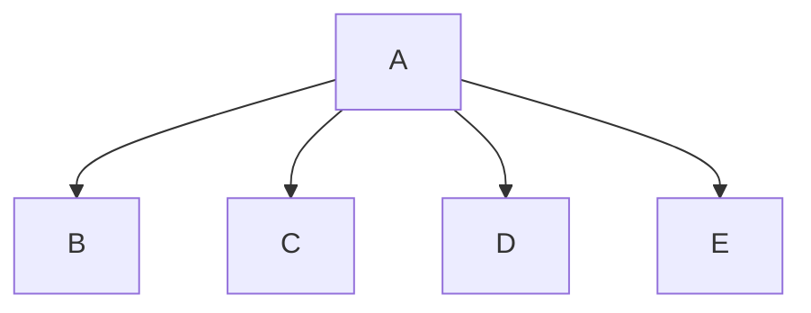

# Python Project
Asher Ringer and Riley Ternes

## <Number Guesser> Description
This program allows the users to take turns guessing a random number between 1-100

### <Number Guesser> Flowchart

#### Function Diagrams

| `main`    |  Riley Ternes     |
***
| `menu`    |               |     Asher Ringer   |
| ------------------ | ------------- | ------------ |
| | displays menu | returns selection |
|   | takes input from the user as to what range they want to play in | returns range |
***
| `name`    |               |     Riley Ternes   |
| ------------------ | ------------- | ------------ |
|     | takes input from the user for their name  | returns player1 and player2|

***
| `random_integer`    |               |     Riley Ternes   |
| ------------------ | ------------- | ------------ |
|     | generates a random integer from 1-100, including both numbers | returns random_number|

***
| `take_turns`    |               |     Asher Ringer   |
| ------------------ | ------------- | ------------ |
| `receives random_number`    | takes input from the user for the number picked, validates it, provides feedback, and keeps track of the number of turns taken  |           |
|  receives player1 and player2 | displays their names when the users take turns picking a number | |
| | validates number | returns selection |
***
