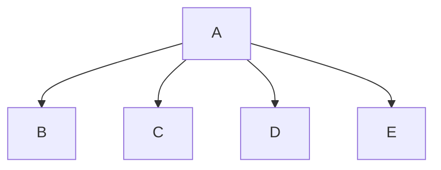

# Python Project
Asher Ringer and Riley Ternes

## <Number Guesser> Description
This program allows the users to take turns guessing a random number between 1-100

### <Number Guesser> Flowchart

#### Function Diagrams

| `main`    |               |  Riley Ternes     |
| ------------------ | ------------- | ------------ |
| `argument:type`    | takes input from the user for ____  |              |
| `time:integer`     | calculates ______  | outputs ____             |
| `name:string`      | takes input for name ___ | returns none |
***
| `menu`    |               |     Asher Ringer   |
| ------------------ | ------------- | ------------ |
| `argument:type`    | takes input from the user for the menu  |              |
| `time:integer`     | calculates ______  | outputs ____             |
| `name:string`      | takes input for name ___ | returns selection |
***
| `name`    |               |     Riley Ternes   |
| ------------------ | ------------- | ------------ |
| `argument:type`    | takes input from the user for their name  |              |
| `time:integer`     | calculates ______  | outputs ____             |
| `name:string`      | takes input for name ___ | returns total |
***
| `random_integer`    |               |     author   |
| ------------------ | ------------- | ------------ |
| `argument:type`    | takes input from the user for ____  |              |
| `time:integer`     | calculates ______  | outputs ____             |
| `name:string`      | takes input for name ___ | returns guessing_number |
***
| `take_turns`    |               |     author   |
| ------------------ | ------------- | ------------ |
| `argument:type`    | takes input from the user for ____  |              |
| `time:integer`     | calculates ______  | outputs ____             |
| `name:string`      | takes input for name ___ | returns total |
***
